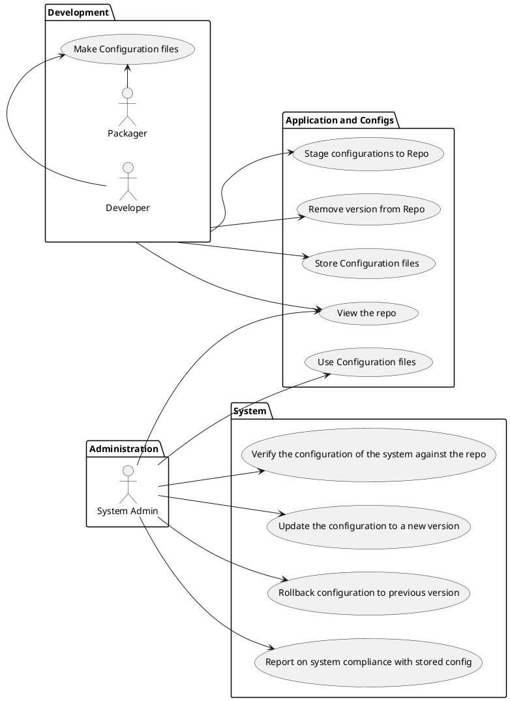
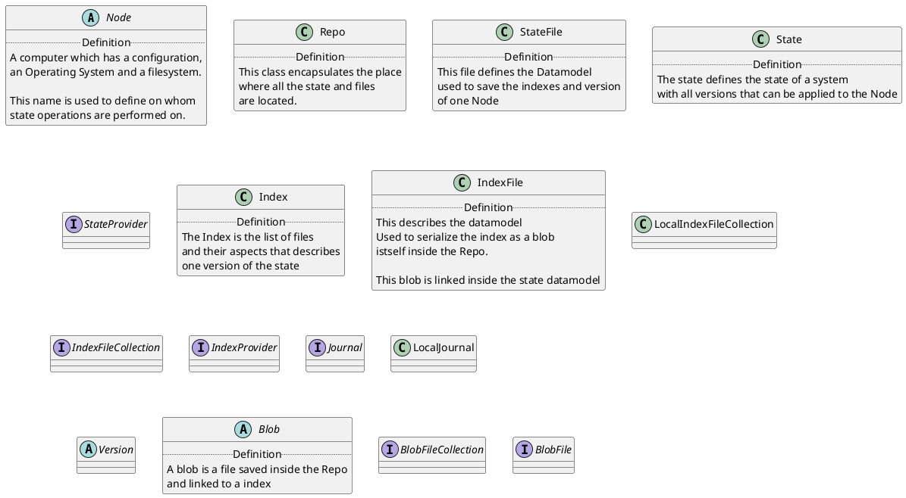

# Use Cases

```plantuml
@startuml
left to right direction

package Administration {
    actor "System Admin" as a
}

package Development {
    actor "Developer" as d
    actor "Packager" as p
    usecase "Make Configuration files" as mcf
    p -> mcf
    d -> mcf
}

package "Application and Configs" {
    usecase "Store Configuration files" as scf
    usecase "Use Configuration files" as ucf
    a -> ucf
    Development --> scf
    usecase "View the repo" as view_repo
    usecase "Stage configurations to Repo" as stage
    usecase "Remove version from Repo" as remove_version
    Development --> stage
    Development --> remove_version
}

package System {
    usecase "Verify the configuration of the system against the repo" as verify
    usecase "Update the configuration to a new version" as update
    usecase "Rollback configuration to previous version" as rollback
    usecase "Report on system compliance with stored config" as report
    a --> verify
    a --> update
    a --> rollback
    a --> report
    a --> view_repo
    Development --> view_repo
}

@enduml
```

# Entities

```plantuml
@startuml

abstract Node {
    .. Definition ..
    A computer which has a configuration,
    an Operating System and a filesystem.
    
    This name is used to define on whom
    state operations are performed on.
}

class Repo {
    .. Definition ..
    This class encapsulates the place
    where all the state and files
    are located.
}


class StateFile {
    .. Definition ..
    This file defines the Datamodel 
    used to save the indexes and version
    of one Node
}

class State {
    .. Definition ..
    The state defines the state of a system
    with all versions that can be applied to the Node
}

interface StateProvider


class Index {
    .. Definition ..
    The Index is the list of files
    and their aspects that describes
    one version of the state
}

class IndexFile {
    .. Definition ..
    This describes the datamodel
    Used to serialize the index as a blob
    istself inside the Repo.
    
    This blob is linked inside the state datamodel
}

class LocalIndexFileCollection

interface IndexFileCollection

interface IndexProvider


interface Journal

class LocalJournal

abstract Version

abstract Blob {
    .. Definition ..
    A blob is a file saved inside the Repo 
    and linked to a index
}

interface BlobFileCollection

interface BlobFile

@enduml
```