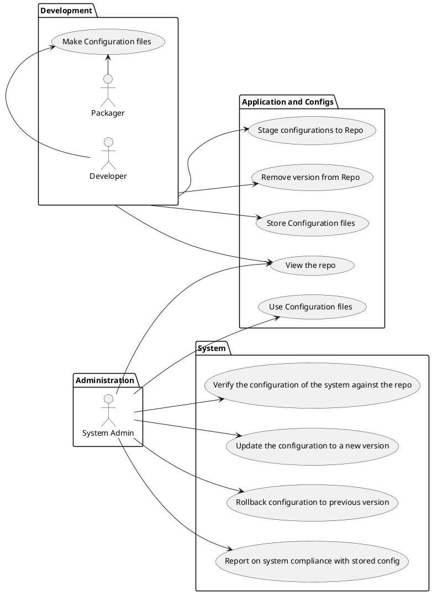

# Use Cases

```plantuml
@startuml
left to right direction

package Administration {
    actor "System Admin" as a
}

package Development {
    actor "Developer" as d
    actor "Packager" as p
    usecase "Make Configuration files" as mcf
    p -> mcf
    d -> mcf
}

package "Application and Configs" {
    usecase "Store Configuration files" as scf
    usecase "Use Configuration files" as ucf
    a -> ucf
    Development --> scf
    usecase "View the repo" as view_repo
    usecase "Stage configurations to Repo" as stage
    usecase "Remove version from Repo" as remove_version
    Development --> stage
    Development --> remove_version
}

package System {
    usecase "Verify the configuration of the system against the repo" as verify
    usecase "Update the configuration to a new version" as update
    usecase "Rollback configuration to previous version" as rollback
    usecase "Report on system compliance with stored config" as report
    a --> verify
    a --> update
    a --> rollback
    a --> report
    a --> view_repo
    Development --> view_repo
}

@enduml
```